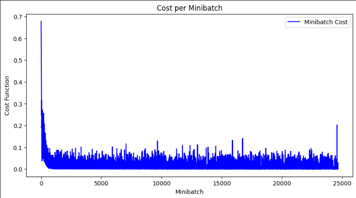
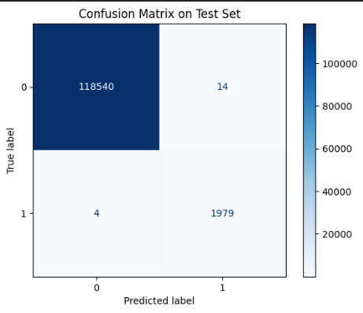

# Détection d'Anomalies dans les Logs

## Objectif du Projet
Ce projet vise à développer un modèle capable de détecter des anomalies dans les logs systèmes en utilisant des techniques avancées de machine learning.

Il se décompose en trois étapes principales :

1. Parsing des logs bruts pour les structurer.
2. Extraction et transformation des caractéristiques.
3. Entraînement et évaluation d'un modèle CNN pour identifier des anomalies dans les logs.

La détection d’anomalies dans les logs est cruciale pour :
- **Cybersécurité** : Identifier des comportements suspects ou des attaques potentielles.
- **Maintenance prédictive** : Prévoir des défaillances dans les systèmes.
- **Optimisation de la performance** : Repérer les erreurs récurrentes et les goulots d'étranglement.

### Avant de commencer, installez les dépendances :
!pip install -r requirements.txt

## Structure du Projet

Ce projet est organisé en trois étapes :

### Étape 1 : Parsing des Logs (Répertoire `parse`)

Dans cette étape, les logs bruts sont analysés et transformés en un format structuré.
L'objectif est de regrouper les événements similaires sous des modèles communs pour simplifier l’analyse ultérieure.

Les données structurées sont sauvegardées dans le répertoire `DataSet_HDFS` pour une utilisation dans les étapes suivantes.

### Étape 2 : Extraction des Caractéristiques (Répertoire `process`)

Dans cette étape, les logs structurés sont transformés en matrices de caractéristiques.
En appliquant des techniques de pondération TF-IDF et de fenêtrage glissant, chaque séquence d'événements est convertie en une image temporelle, ce qui permet au modèle CNN d’apprendre à détecter les anomalies dans les motifs.

### Étape 3 : Entraînement et Évaluation du Modèle CNN (Fichier `Detection_anomalie.ipynb`)

Dans le fichier `Detection_anomalie.ipynb`, un modèle CNN est entraîné pour détecter les anomalies en utilisant les caractéristiques extraites.

- **Entraînement** : Le modèle apprend à distinguer les séquences normales des séquences anormales en utilisant des matrices de caractéristiques comme données d’entrée.
- **Évaluation des Résultats** : Les performances du modèle sont mesurées via les métriques de précision, rappel, et score F1.

### Résultats et Graphes

Les résultats de l'entraînement sont visualisés sous forme de courbes et de matrices, permettant une évaluation visuelle des performances du modèle.

## Courbe d'Entraînement
Affiche l'évolution de la précision et de la perte au fil des époques.

## Courbe de Validation
Affiche la précision de détection des anomalies sur l'ensemble de validation.

## Matrice de Confusion
Visualise les erreurs de classification du modèle entre les classes normales et anormales.

# ## Conclusion
Ce projet de détection d'anomalies dans les logs combine structuration des données, extraction des caractéristiques, et apprentissage profond.
Il s’agit d’une solution complète permettant une surveillance proactive des systèmes et une détection efficace des comportements anormaux.

display(Image(filename='results/accuracy.png', width=600, height=400))

# NP : Les données de ce projet sont extraite de la collection de HDFS de loghub : https://github.com/logpai/loghub/tree/master 
